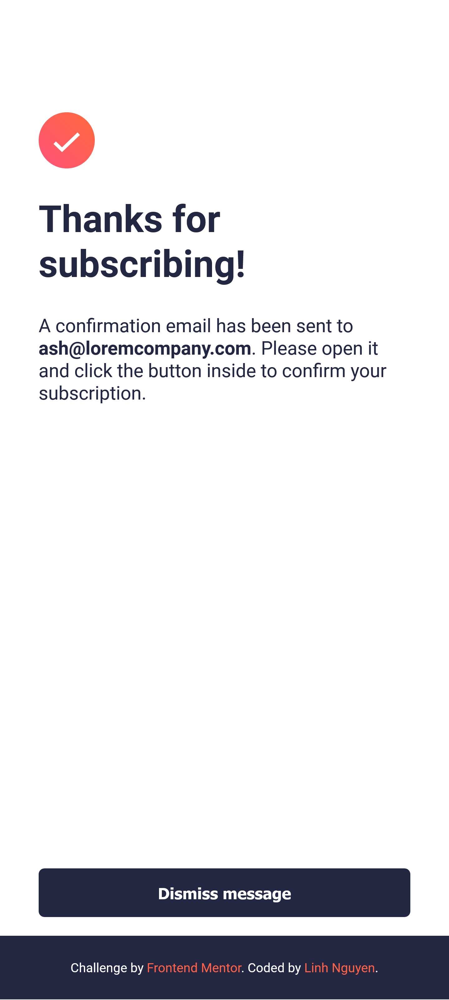

# Frontend Mentor - Newsletter sign-up form with success message solution

## Table of contents

- [Overview](#overview)
  - [The challenge](#the-challenge)
  - [Screenshot](#screenshot)
  - [Links](#links)
- [My process](#my-process)
  - [Built with](#built-with)
  - [What I learned](#what-i-learned)
  - [Continued development](#continued-development)
  - [Useful resources](#useful-resources)
- [Author](#author)

## Overview

### The challenge

Users should be able to:

- Add their email and submit the form
- See a success message with their email after successfully submitting the form
- See form validation messages if:
  - The field is left empty
  - The email address is not formatted correctly
- View the optimal layout for the interface depending on their device's screen size
- See hover and focus states for all interactive elements on the page

### Screenshot

_1. Desktop_


_2. Sign up success state on desktop_


_3. Mobile_


_4. Sign up success state on mobile_



### Links

<!-- - Solution URL: [Add solution URL here](https://your-solution-url.com) -->
- Live Site URL: [Add live site URL here](https://your-live-site-url.com)

## My process

### Built with

- Semantic HTML5 markup
- CSS custom properties
- Flexbox
- Javascript

### What I learned

- Using event "keyup" to check user's input
- Build function to check user's input (the regex code is from this page: [Email address validation from regexr.com](https://regexr.com/3e48o))
- Click to submit a form
- Solution for "Cannot set property src of null" is to wrap all variables into the DOMContentLoaded event to wait for the DOM to load everything then change the img source. [Read more from this article](https://stackoverflow.com/questions/17237142/cannot-set-property-src-of-null);

```js
//Javascript
document.addEventListener("DOMContentLoaded", function() => {
 //TODO ... 
})

//Jquery
$(document).ready(function(){
  //TODO ...
})
```

```js
function checkValidEmail(email) {
  let reg = /^[\w-\.]+@([\w-]+\.)+[\w-]{2,4}$/;

  if (email === "") {
    return false;
  }

  if (reg.test(email) === false) {
    return false;
  }

  return true;
}

emailaddr.addEventListener("keyup", function () {
  console.log(this.value);
  flag = checkValidEmail(this.value);
  // console.log('Flag: '+flag);
  if (!flag) {
    msg.innerHTML = errorMsg;
    msg.classList.add("errorMsg");
    this.classList.add("error");
    msg.classList.remove("successMsg");
    this.classList.remove("success");
  } else {
    msg.innerHTML = successMsg;
    msg.classList.add("successMsg");
    this.classList.add("success");
    msg.classList.remove("errorMsg");
    this.classList.remove("error");
  }
});
```

### Continued development

I will try using __ReactJS__ for this challenge.

### Useful resources

- [CSS Gradient](https://cssgradient.io/) - Mix and match background color

## Author

- Frontend Mentor - [@auri222](https://www.frontendmentor.io/profile/auri222)
